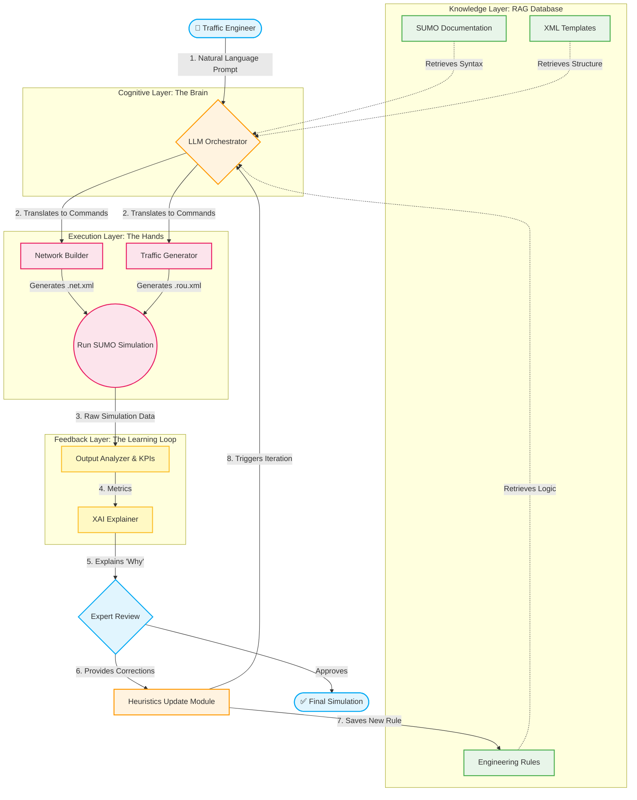

# fyp

```mermaid
graph TD
    %% Define visual styles
    classDef user fill:#e1f5fe,stroke:#03a9f4,stroke-width:2px;
    classDef llm fill:#fff3e0,stroke:#ff9800,stroke-width:2px;
    classDef rag fill:#e8f5e9,stroke:#4caf50,stroke-width:2px;
    classDef sumo fill:#fce4ec,stroke:#e91e63,stroke-width:2px;
    classDef feedback fill:#fff9c4,stroke:#fbc02d,stroke-width:2px;

    %% User Input
    User([👤 Traffic Engineer]):::user -->|1. Natural Language Prompt| Orchestrator

    %% Cognitive Layer
    subgraph Cognitive Layer: The Brain
        Orchestrator{LLM Orchestrator}:::llm
    end

    %% Knowledge Layer
    subgraph Knowledge Layer: RAG Database
        Docs[SUMO Documentation]:::rag
        Templates[XML Templates]:::rag
        Heuristics[Engineering Rules]:::rag
    end

    %% RAG Interaction
    Docs -.->|Retrieves Syntax| Orchestrator
    Templates -.->|Retrieves Structure| Orchestrator
    Heuristics -.->|Retrieves Logic| Orchestrator

    %% Generation Layer
    subgraph Execution Layer: The Hands
        NetBuilder[Network Builder]:::sumo
        TraffGen[Traffic Generator]:::sumo
        SimRun((Run SUMO Simulation)):::sumo
    end

    Orchestrator -->|2. Translates to Commands| NetBuilder
    Orchestrator -->|2. Translates to Commands| TraffGen
    NetBuilder -->|Generates .net.xml| SimRun
    TraffGen -->|Generates .rou.xml| SimRun

    %% Output & Feedback Layer
    subgraph Feedback Layer: The Learning Loop
        Output[Output Analyzer & KPIs]:::feedback
        XAI[XAI Explainer]:::feedback
    end

    SimRun -->|3. Raw Simulation Data| Output
    Output -->|4. Metrics| XAI
    XAI -->|5. Explains 'Why'| ExpertReview{Expert Review}:::user

    %% The Expert Loop
    ExpertReview -->|Approves| Done([✅ Final Simulation]):::user
    ExpertReview -->|6. Provides Corrections| UpdateMod[Heuristics Update Module]:::llm

    %% The Update Mechanism
    UpdateMod -->|7. Saves New Rule| Heuristics
    UpdateMod -->|8. Triggers Iteration| Orchestrator
```
