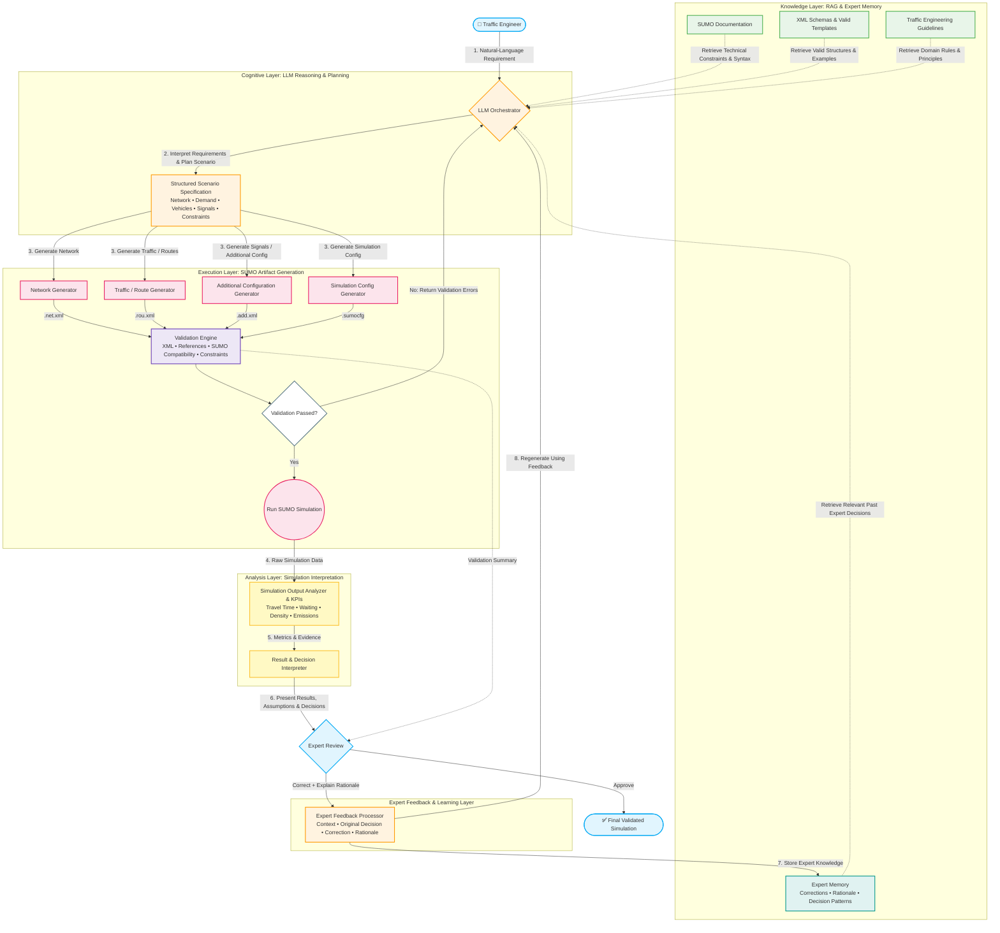

# fyp

```mermaid
graph TD
    %% =========================
    %% VISUAL STYLES
    %% =========================
    classDef user fill:#e1f5fe,stroke:#03a9f4,stroke-width:2px;
    classDef llm fill:#fff3e0,stroke:#ff9800,stroke-width:2px;
    classDef rag fill:#e8f5e9,stroke:#4caf50,stroke-width:2px;
    classDef sumo fill:#fce4ec,stroke:#e91e63,stroke-width:2px;
    classDef validate fill:#ede7f6,stroke:#673ab7,stroke-width:2px;
    classDef feedback fill:#fff9c4,stroke:#fbc02d,stroke-width:2px;
    classDef memory fill:#e0f2f1,stroke:#009688,stroke-width:2px;
    classDef decision fill:#ffffff,stroke:#607d8b,stroke-width:2px;

    %% =========================
    %% USER INPUT
    %% =========================
    User([👤 Traffic Engineer]):::user
        -->|1. Natural-Language Requirement| Orchestrator

    %% =========================
    %% COGNITIVE LAYER
    %% =========================
    subgraph Cognitive["Cognitive Layer: LLM Reasoning & Planning"]
        Orchestrator{LLM Orchestrator}:::llm
        ScenarioSpec["Structured Scenario Specification<br/>Network • Demand • Vehicles • Signals • Constraints"]:::llm

        Orchestrator -->|2. Interpret Requirements & Plan Scenario| ScenarioSpec
    end

    %% =========================
    %% KNOWLEDGE LAYER
    %% =========================
    subgraph Knowledge["Knowledge Layer: RAG & Expert Memory"]

        Docs["SUMO Documentation"]:::rag
        Templates["XML Schemas & Valid Templates"]:::rag
        EngKnowledge["Traffic Engineering Guidelines"]:::rag

        ExpertMemory["Expert Memory<br/>Corrections • Rationale • Decision Patterns"]:::memory
    end

    %% Knowledge Retrieval
    Docs -.->|Retrieve Technical Constraints & Syntax| Orchestrator
    Templates -.->|Retrieve Valid Structures & Examples| Orchestrator
    EngKnowledge -.->|Retrieve Domain Rules & Principles| Orchestrator
    ExpertMemory -.->|Retrieve Relevant Past Expert Decisions| Orchestrator

    %% =========================
    %% EXECUTION / GENERATION LAYER
    %% =========================
    subgraph Execution["Execution Layer: SUMO Artifact Generation"]

        NetBuilder["Network Generator"]:::sumo
        RouteGen["Traffic / Route Generator"]:::sumo
        AddGen["Additional Configuration Generator"]:::sumo
        ConfigGen["Simulation Config Generator"]:::sumo

        Validator["Validation Engine<br/>XML • References • SUMO Compatibility • Constraints"]:::validate
        ValidCheck{"Validation Passed?"}:::decision

        SimRun((Run SUMO Simulation)):::sumo
    end

    ScenarioSpec -->|3. Generate Network| NetBuilder
    ScenarioSpec -->|3. Generate Traffic / Routes| RouteGen
    ScenarioSpec -->|3. Generate Signals / Additional Config| AddGen
    ScenarioSpec -->|3. Generate Simulation Config| ConfigGen

    NetBuilder -->|.net.xml| Validator
    RouteGen -->|.rou.xml| Validator
    AddGen -->|.add.xml| Validator
    ConfigGen -->|.sumocfg| Validator

    Validator --> ValidCheck

    %% Automatic repair loop
    ValidCheck -->|No: Return Validation Errors| Orchestrator
    ValidCheck -->|Yes| SimRun

    %% =========================
    %% ANALYSIS LAYER
    %% =========================
    subgraph Analysis["Analysis Layer: Simulation Interpretation"]

        Output["Simulation Output Analyzer & KPIs<br/>Travel Time • Waiting • Density • Emissions"]:::feedback
        Interpreter["Result & Decision Interpreter"]:::feedback
    end

    SimRun -->|4. Raw Simulation Data| Output
    Output -->|5. Metrics & Evidence| Interpreter

    %% =========================
    %% EXPERT REVIEW
    %% =========================
    Interpreter -->|6. Present Results, Assumptions & Decisions| ExpertReview{Expert Review}:::user
    Validator -.->|Validation Summary| ExpertReview

    ExpertReview -->|Approve| Done([✅ Final Validated Simulation]):::user
    ExpertReview -->|Correct + Explain Rationale| FeedbackProcessor

    %% =========================
    %% EXPERT LEARNING LOOP
    %% =========================
    subgraph Learning["Expert Feedback & Learning Layer"]

        FeedbackProcessor["Expert Feedback Processor<br/>Context • Original Decision • Correction • Rationale"]:::llm
    end

    FeedbackProcessor -->|7. Store Expert Knowledge| ExpertMemory
    FeedbackProcessor -->|8. Regenerate Using Feedback| Orchestrator
```
