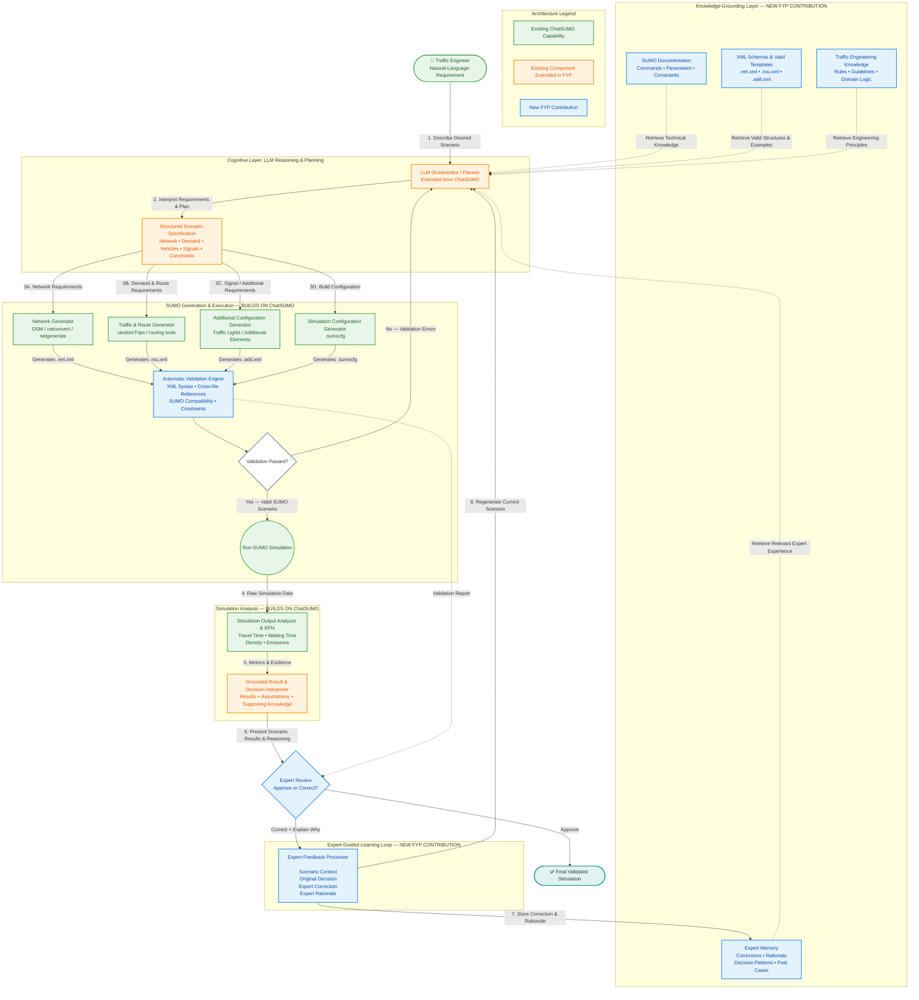

# fyp

```mermaid
graph TD

    %% =====================================================
    %% COLOUR LEGEND
    %% =====================================================
    classDef existing fill:#e8f5e9,stroke:#43a047,stroke-width:2px,color:#1b5e20;
    classDef extended fill:#fff3e0,stroke:#fb8c00,stroke-width:2px,color:#e65100;
    classDef newfyp fill:#e3f2fd,stroke:#1e88e5,stroke-width:2px,color:#0d47a1;
    classDef decision fill:#ffffff,stroke:#607d8b,stroke-width:2px;
    classDef final fill:#e0f2f1,stroke:#00897b,stroke-width:2px;

    %% =====================================================
    %% LEGEND
    %% =====================================================
    subgraph Legend["Architecture Legend"]
        L1["Existing ChatSUMO Capability"]:::existing
        L2["Existing Component Extended in FYP"]:::extended
        L3["New FYP Contribution"]:::newfyp
    end

    %% =====================================================
    %% USER INPUT
    %% =====================================================
    User(["👤 Traffic Engineer<br/>Natural-Language Requirement"]):::existing
        -->|1. Describe Desired Scenario| Orchestrator

    %% =====================================================
    %% COGNITIVE / REASONING LAYER
    %% =====================================================
    subgraph Cognitive["Cognitive Layer: LLM Reasoning & Planning"]

        Orchestrator["LLM Orchestrator / Planner<br/><i>Extended from ChatSUMO</i>"]:::extended

        ScenarioSpec["Structured Scenario Specification<br/>Network • Demand • Vehicles • Signals • Constraints"]:::extended

        Orchestrator -->|2. Interpret Requirements & Plan| ScenarioSpec
    end

    %% =====================================================
    %% KNOWLEDGE & EXPERT MEMORY LAYER
    %% =====================================================
    subgraph Knowledge["Knowledge-Grounding Layer — NEW FYP CONTRIBUTION"]

        Docs["SUMO Documentation<br/>Commands • Parameters • Constraints"]:::newfyp

        Templates["XML Schemas & Valid Templates<br/>.net.xml • .rou.xml • .add.xml"]:::newfyp

        EngKnowledge["Traffic Engineering Knowledge<br/>Rules • Guidelines • Domain Logic"]:::newfyp

        ExpertMemory["Expert Memory<br/>Corrections • Rationale<br/>Decision Patterns • Past Cases"]:::newfyp
    end

    %% Retrieval into reasoning
    Docs -.->|Retrieve Technical Knowledge| Orchestrator
    Templates -.->|Retrieve Valid Structures & Examples| Orchestrator
    EngKnowledge -.->|Retrieve Engineering Principles| Orchestrator
    ExpertMemory -.->|Retrieve Relevant Expert Experience| Orchestrator

    %% =====================================================
    %% SUMO GENERATION / EXECUTION LAYER
    %% =====================================================
    subgraph Execution["SUMO Generation & Execution — BUILDS ON ChatSUMO"]

        NetBuilder["Network Generator<br/>OSM / netconvert / netgenerate"]:::existing

        RouteGen["Traffic & Route Generator<br/>randomTrips / routing tools"]:::existing

        AddGen["Additional Configuration Generator<br/>Traffic Lights / Additional Elements"]:::existing

        ConfigGen["Simulation Configuration Generator<br/>.sumocfg"]:::existing

        Validator["Automatic Validation Engine<br/>XML Syntax • Cross-file References<br/>SUMO Compatibility • Constraints"]:::newfyp

        ValidCheck{"Validation Passed?"}:::decision

        SimRun(("Run SUMO Simulation")):::existing
    end

    ScenarioSpec -->|3A. Network Requirements| NetBuilder
    ScenarioSpec -->|3B. Demand & Route Requirements| RouteGen
    ScenarioSpec -->|3C. Signal / Additional Requirements| AddGen
    ScenarioSpec -->|3D. Build Configuration| ConfigGen

    NetBuilder -->|Generates .net.xml| Validator
    RouteGen -->|Generates .rou.xml| Validator
    AddGen -->|Generates .add.xml| Validator
    ConfigGen -->|Generates .sumocfg| Validator

    Validator --> ValidCheck

    %% =====================================================
    %% AUTOMATIC VALIDATION / REPAIR LOOP
    %% =====================================================
    ValidCheck -->|No — Validation Errors| Orchestrator
    ValidCheck -->|Yes — Valid SUMO Scenario| SimRun

    %% =====================================================
    %% ANALYSIS LAYER
    %% =====================================================
    subgraph Analysis["Simulation Analysis — BUILDS ON ChatSUMO"]

        Output["Simulation Output Analyzer & KPIs<br/>Travel Time • Waiting Time<br/>Density • Emissions"]:::existing

        Interpreter["Grounded Result & Decision Interpreter<br/>Results + Assumptions + Supporting Knowledge"]:::extended
    end

    SimRun -->|4. Raw Simulation Data| Output

    Output -->|5. Metrics & Evidence| Interpreter

    %% =====================================================
    %% EXPERT-GUIDED LEARNING
    %% =====================================================
    Interpreter -->|6. Present Scenario, Results & Reasoning| ExpertReview

    Validator -.->|Validation Report| ExpertReview

    ExpertReview{"Expert Review<br/>Approve or Correct?"}:::newfyp

    ExpertReview -->|Approve| Done(["✅ Final Validated Simulation"]):::final

    ExpertReview -->|Correct + Explain Why| FeedbackProcessor

    subgraph Learning["Expert-Guided Learning Loop — NEW FYP CONTRIBUTION"]

        FeedbackProcessor["Expert Feedback Processor<br/><br/>Scenario Context<br/>Original Decision<br/>Expert Correction<br/>Expert Rationale"]:::newfyp
    end

    FeedbackProcessor -->|7. Store Correction & Rationale| ExpertMemory

    FeedbackProcessor -->|8. Regenerate Current Scenario| Orchestrator
```
